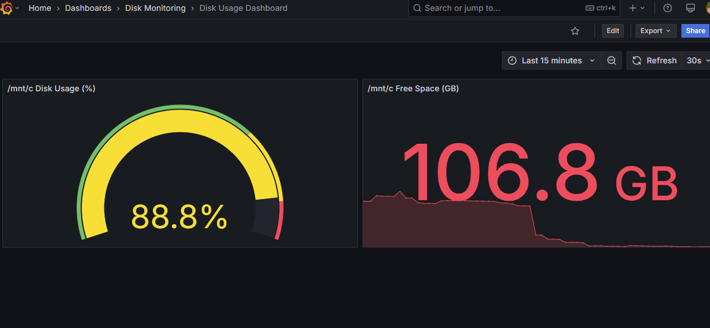

# 📊 Disk Monitoring Stack

This project sets up a lightweight monitoring stack using **Prometheus**, **Grafana**, and **Node Exporter** to track disk usage (used, free, and total space) on a Linux system — including WSL2 paths like `/mnt/c`.

It includes:
- Automatic dashboard provisioning in Grafana
- Clean Makefile for easy control
- Ready-to-use Docker Compose setup
- Script to view your project structure easily

---

```## 🚀 Stack Overview

| Component     | Purpose                                | Access URL               |
|---------------|----------------------------------------|--------------------------|
| Prometheus    | Scrapes and stores system metrics      | http://localhost:9090    |
| Node Exporter | Exposes disk, memory, and CPU metrics  | http://localhost:9100    |
| Grafana       | Visualizes metrics from Prometheus     | http://localhost:3000    |

---
```

```## 📁 Project Structure

> View it using:
./show_structure.sh
```

Example output:

```
📁 Project Structure (Disk Monitoring)
---------------------------------------
.
├── Makefile
├── README.md
├── docker-compose.yml
├── grafana
│   └── provisioning
│       ├── dashboards
│       │   ├── dashboards.yml
│       │   └── disk-usage.json
│       └── datasources
│           └── prometheus.yml
├── prometheus
│   └── prometheus.yml
└── show_structure.sh

✅ Structure displayed (hidden files excluded)
```

---

## 🧰 Requirements

- [Docker](https://www.docker.com/)
- [Docker Compose](https://docs.docker.com/compose/)
- [gh CLI (for GitHub)](https://cli.github.com/) *(optional)*
- [GNU Make](https://www.gnu.org/software/make/)

---

## ⚙️ Usage

1. **Clone the repo:**

```bash
git clone https://github.com/Sreyeesh/disk-monitoring.git
cd disk-monitoring
```

2. **Start the stack:**

```bash
make up
```

3. **Access services:**

```bash
make open
```

4. **Stop everything:**

```bash
make down
```

5. **Other commands:**

```bash
make logs       # View container logs
make status     # Show running containers
make clean      # Remove containers and volumes
make restart    # Restart the entire stack
make structure  # Show the project file tree
```

---

## 📊 Dashboard Preview

> Add your screenshot here



---

## 📦 Technologies Used

- Docker
- Docker Compose
- Prometheus
- Node Exporter
- Grafana
- Make
- Bash (`show_structure.sh`)
---

## 👨‍💻 Author

**Sreyeesh Garimella**  
🔗 [github.com/Sreyeesh](https://github.com/Sreyeesh)


